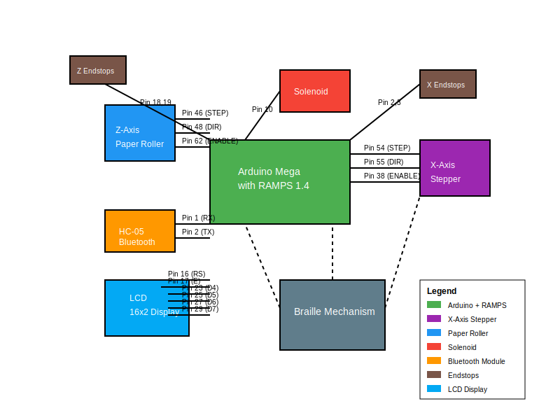

# Braille Printer

## Project Overview

This project is an Arduino-based Braille printer capable of translating regular text into standard Braille patterns and physically impressing them onto paper. The printer receives text via Bluetooth or USB Serial connection and prints Braille dots using a solenoid mechanism.



## Features

- Translates text to standard Braille (letters and numbers)
- Prints in mirrored format for proper reading when flipped
- Prints row-by-row across all characters in a line
- Uses proper Braille dimensions (2mm gaps, 6mm char spacing, 12mm word spacing)
- Accepts input via Bluetooth or Serial connection
- Supports number mode with proper number sign
- Automatic return to home position between printing rows
- Paper advancement for new lines
- Test mode for quick testing without Bluetooth connection

## Hardware Components

- **Arduino MEGA**: Main controller
- **RAMPS 1.4 Shield**: Stepper motor driver shield
- **HC-05 Bluetooth Module**: For wireless communication
- **X-axis Stepper Motor**: Controls horizontal movement of the solenoid
- **Z-axis Stepper Motor**: Controls paper advancement (roller)
- **Solenoid**: Creates Braille dots by pressing onto paper
- **Endstops**: Limit switches for X and Z axes for homing
- **12V Power Supply**: Powers the system

## Pin Connections

### X-Axis Stepper Motor (Horizontal Movement)

- STEP: Pin 54
- DIR: Pin 55
- ENABLE: Pin 38
- MIN Endstop: Pin 3
- MAX Endstop: Pin 2

### Z-Axis Stepper Motor (Paper Roller)

- STEP: Pin 46
- DIR: Pin 48
- ENABLE: Pin 62
- MIN Endstop: Pin 18
- MAX Endstop: Pin 19

### Other Components

- Solenoid: Pin 10
- Bluetooth RX: Pin 1 (Connected to AUX-1)
- Bluetooth TX: Pin 2 (Connected to AUX-1)

## How It Works

### Braille Encoding

Braille characters consist of 6 dots arranged in a 3x2 grid. In the code, each character is represented by a byte where each bit represents the presence or absence of a dot:

```
0 3
1 4
2 5
```

For example, the letter 'a' is represented by dot 0 only, which corresponds to the binary pattern `00000001`.

### Printing Process

1. **Text Reception**: The printer receives text via Bluetooth or Serial.
2. **Text Processing**: Each character is converted to its Braille representation.
3. **Line Preparation**: Characters are prepared for row-by-row printing.
4. **Printing**: The printer prints each row of dots across all characters before moving to the next row.
   - First, it prints the top row of dots for all characters in the line.
   - Then it advances the paper slightly and prints the middle row.
   - Finally, it advances again and prints the bottom row.
5. **Line Advancement**: After completing all three rows, the paper advances to prepare for the next line.

### Number Mode

In Braille, numbers are represented using the same patterns as the first ten letters (a-j) but with a special "number sign" prefix. The printer automatically detects numbers and adds the appropriate number sign.

## Commands

The printer supports several commands:

- `#HOME`: Return X-axis to home position
- `#RESET`: Reset both X and Z axes to home positions
- `#TEST=text`: Print the specified text as a test

Commands can be sent via Serial monitor or Bluetooth.

## Dimensions and Calibration

The printer is calibrated for standard Braille dimensions:

- Dot diameter: 1.4mm
- Gap between dots: 2mm
- Character spacing: 6mm
- Word spacing: 12mm
- Line spacing: 15mm

These dimensions are converted to stepper motor steps in the code.

## Paper Handling

The printer is designed for Letter size paper (8.5" x 11") and includes appropriate margins. It tracks position on the page and provides a warning when approaching the end of the page.

## Troubleshooting

### Common Issues

1. **Printer not responding to Bluetooth**: Check Bluetooth connection and ensure the module is properly powered.
2. **Inconsistent dot spacing**: Calibrate stepper motor steps per mm (`STEP_PER_MM` constant).
3. **Weak dot impression**: Adjust `DOT_PRESS_TIME` to increase solenoid activation time.
4. **Printer losing position**: Ensure endstops are properly connected and functioning.

### Diagnostics

The printer outputs detailed diagnostic information via Serial monitor, including:

- Current character being processed
- Dot patterns being printed
- X and Z axis movements
- Command processing

## Future Improvements

Potential enhancements for the project:

- Support for additional Braille codes (Grade 2 Braille)
- Multiple language support
- Web interface for remote printing
- Battery power option for portability
- Automatic paper feed mechanism for multiple pages

## License

This project is open-source and free to use for educational and non-commercial purposes.
